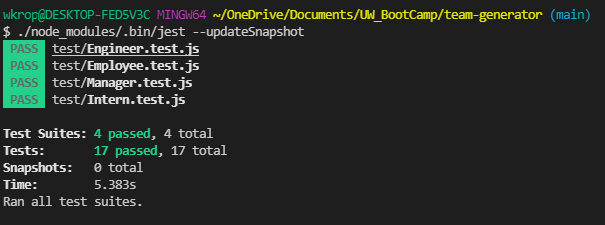

# Team Profile Generator

## Description

This is a command line application desiged for managers to build teams at work. Based on a series of command line inputs taken via inquirer, an html page is output using fs. The output page displays team members and information about them.

## Deliverables

[Video Demo Here](https://watch.screencastify.com/v/JBefmVFtjiniVMFA0OtL)  

[Output HTML live](https://wkropat.github.io/team-generator/)  

[Github Repo](https://github.com/wkropat/team-generator)  

## Usage

In your CLI, navigate to this folder and type node index.js. Answer the series of prompts and an html page will be generated.

## Test
 Test this application using [Jest](https://jestjs.io/). 
 
